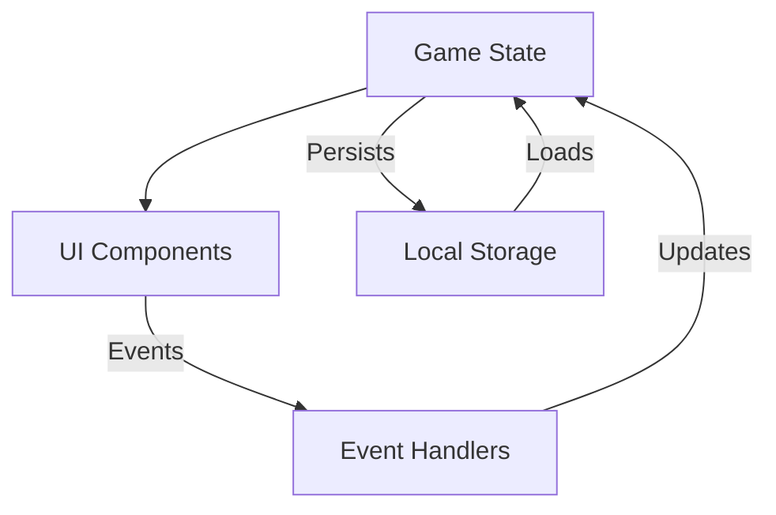

# Monopoly Deal - System Patterns

## System Architecture

The Monopoly Deal game follows a client-side, module-based architecture with the following key components:

```
├── index.html       # Main HTML structure and UI elements
├── styles.css       # CSS styling for all game elements
├── scripts.js       # Main game logic and event handlers
├── cards.js         # Card definitions and card-specific functionality
└── gameState.js     # Game state management and persistence
```

## Key Technical Patterns

### State Management

- Central `gameState` object maintains the entire game state
- All UI updates derive from this single source of truth
- State updates trigger appropriate UI refreshes
- LocalStorage used for cross-tab synchronization

### Event-Driven UI

- User interactions trigger event handlers
- Events update the game state
- State changes propagate to UI updates
- Event delegation used for dynamically created elements

### Component Relationships



### Card Management

- Cards are created from definitions in a centralized catalog
- Card objects contain all data needed for rendering and behavior
- Cards can be moved between different collections (deck, hand, properties, etc.)
- Each card type has specific behavior patterns based on its type

## Component Breakdown

### Game State

- **Player Information**: Hands, properties, money piles
- **Deck Management**: Draw and discard piles
- **Turn Management**: Current player, cards played, actions available
- **Game Status**: Started/not started, winner detection

### UI Components

- **Player Areas**: Hand display, property sets, money piles
- **Game Controls**: Draw pile, discard pile, action buttons
- **Information Displays**: Game status, current player, history
- **Modals**: Action selection, target selection

### Event Flow

1. User initiates action (click on card, button, etc.)
2. Event handler validates the action against game rules
3. If valid, action updates the game state
4. UI refreshes to reflect the updated state
5. Game checks for turn completion or win conditions

## Key Technical Decisions

### Client-Side Only

- Game runs entirely in the browser without server components
- Simplifies deployment and eliminates network dependencies
- Allows for offline play

### Cross-Tab Synchronization

- LocalStorage used to synchronize state between tabs
- Enables "hot seat" play where players can use separate browser tabs
- Preserves state on page refresh

### Dynamic Card Rendering

- Cards rendered based on their type and state
- Same card can appear differently based on context (hand vs. property area)
- Efficient updates by only redrawing affected areas

### Modular Event Handling

- Event handlers focus on specific actions
- Handlers validate actions before execution
- Action options presented through modal dialogs for complex interactions

## Design Patterns Used

### Module Pattern

- Logical grouping of related functionality
- Encapsulation of game mechanics
- Clear separation of concerns

### Observer Pattern

- Game state changes trigger UI updates
- UI components observe the state for changes
- State changes broadcast to all relevant UI components

### Command Pattern

- Actions encapsulated in command objects
- Commands validated before execution
- Consistent pattern for all game interactions

### Factory Pattern

- Card creation from definitions
- UI element generation based on card types
- Consistent object creation processes
